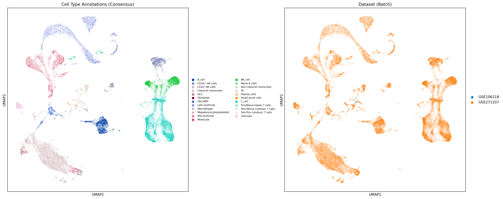
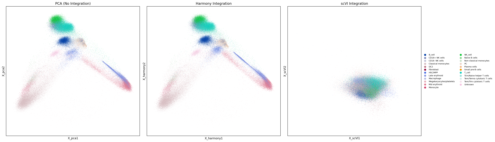
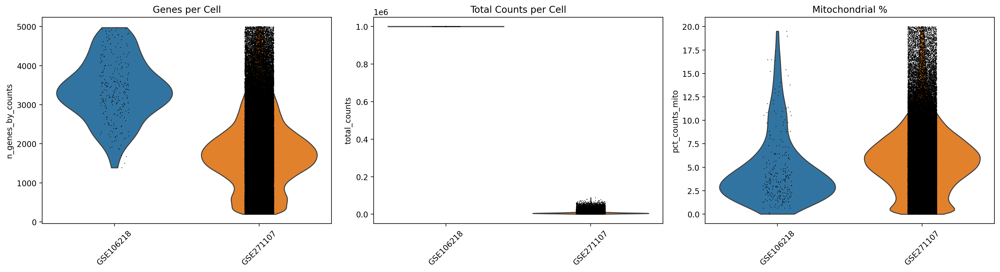
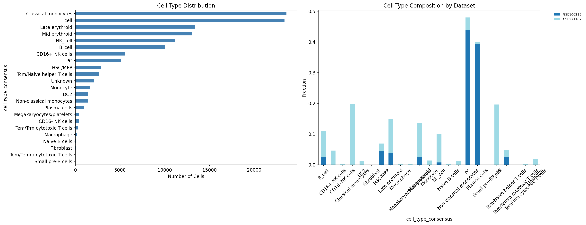
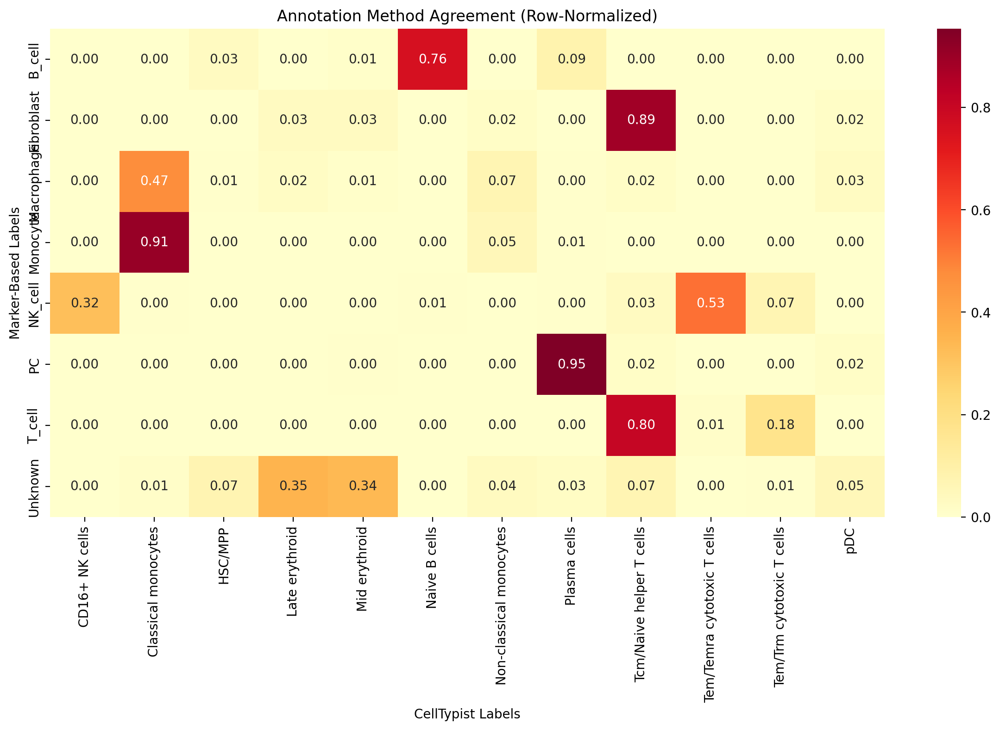
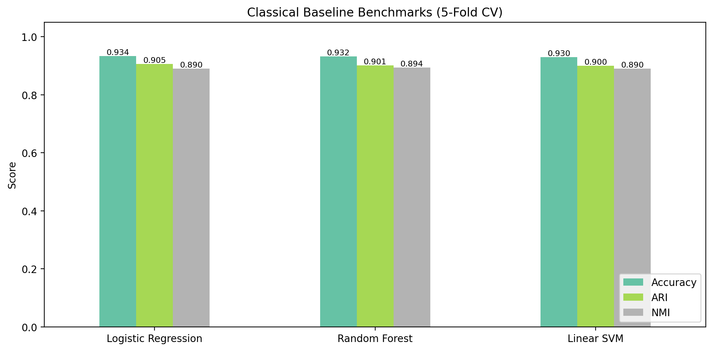

# R3-MM Pipeline: Multiple Myeloma Single-Cell Computational Biology

A comprehensive pipeline for analyzing single-cell RNA-seq data from Multiple Myeloma (MM) patient samples. Integrates preprocessing, batch correction, cell type annotation, classical ML benchmarks, and pseudobulk aggregation with full CLI orchestration.

## Results

### Dataset Summary

The pipeline was run end-to-end on two public GEO datasets:

| Dataset | Cells | Median Genes/Cell | Median UMI/Cell | Median Mito % | Cell Types |
|---------|------:|------------------:|----------------:|--------------:|-----------:|
| GSE271107 (MM Longitudinal) | 119,322 | 1,790 | 6,026 | 5.9% | 23 |
| GSE106218 (MM Atlas) | 265 | 3,373 | 1,000,000 | 3.7% | 8 |
| **Total** | **119,587** | — | — | — | **23** |

### Cell Type Annotation

Three annotation methods were applied and combined via consensus voting:

| Method | Unique Types | Unknown % | NMI vs CellTypist |
|--------|-------------:|----------:|-------------------:|
| Marker-Based | 8 | 31.8% | 0.6642 |
| CellTypist | 16 | 0.0% | — |
| Consensus | 23 | 1.7% | — |

**Cell type distribution (consensus):**

| Cell Type | Cells | Fraction |
|-----------|------:|---------:|
| Classical monocytes | 23,613 | 19.75% |
| T cell | 23,397 | 19.56% |
| Late erythroid | 13,384 | 11.19% |
| Mid erythroid | 13,009 | 10.88% |
| NK cell | 11,103 | 9.28% |
| B cell | 10,068 | 8.42% |
| CD16+ NK cells | 5,503 | 4.60% |
| Plasma cells (PC) | 5,110 | 4.27% |
| HSC/MPP | 2,831 | 2.37% |
| Tcm/Naive helper T cells | 2,628 | 2.20% |
| Other (13 types) | 2,931 | 2.48% |

### UMAP Visualizations

**Cell type annotations and batch structure:**



**Integration method comparison (PCA vs Harmony vs scVI):**



**QC metrics by dataset:**



**Cell type composition by dataset:**



**Annotation method agreement (Marker vs CellTypist):**



### Integration Benchmarks

Batch correction was evaluated on a 20,000-cell subsample across three embedding spaces:

| Method | Bio Silhouette | Batch Silhouette | Graph Connectivity | Batch Entropy (norm) |
|--------|---------------:|-----------------:|-------------------:|---------------------:|
| PCA (no correction) | **0.1640** | 0.0108 | **0.9009** | 0.0005 |
| Harmony | 0.1467 | 0.0668 | 0.9022 | **0.0054** |
| scVI | 0.0853 | **0.5178** | 0.8789 | 0.0010 |

- **Bio Silhouette**: Higher = better biological signal preservation
- **Batch Silhouette**: Higher = stronger batch removal (ideal: high batch sil + high bio sil)
- **Graph Connectivity**: Fraction of k-NN neighbors sharing the same cell type label
- Harmony provides the best balance of batch mixing and biological conservation

### Classical Baseline Benchmarks

Cell type classification on PCA embeddings (5-fold stratified CV, 20,000 cells, 20 cell types):

| Model | Accuracy | ARI | NMI |
|-------|:--------:|:---:|:---:|
| Logistic Regression | **0.9336 +/- 0.0031** | **0.9054 +/- 0.0067** | 0.8896 +/- 0.0068 |
| Random Forest | 0.9316 +/- 0.0036 | 0.9010 +/- 0.0070 | **0.8941 +/- 0.0052** |
| Linear SVM | 0.9300 +/- 0.0028 | 0.9002 +/- 0.0057 | 0.8897 +/- 0.0059 |

All three baselines achieve >93% accuracy and >0.90 ARI, indicating that the consensus cell type labels are well-separated in PCA space.



## Overview

The R3-MM pipeline implements a complete workflow for single-cell RNA-seq analysis with emphasis on reproducibility, scalability, and agentic optimization.

### Key Features

- **CLI Entry Point**: Full pipeline orchestration via `python -m src --stage <name>`
- **Multi-Stage Data Management**: Enforced staging layers (raw -> standardized -> analysis_ready)
- **Batch Effect Correction**: Harmony and scVI integration methods
- **Cell Type Annotation**: CellTypist + marker-based + consensus voting
- **Statistical Testing**: Bootstrap CI, Wilcoxon signed-rank, Friedman tests for benchmark comparisons
- **Agentic Tuning**: Automatic hyperparameter optimization with configurable search space
- **Experiment Tracking**: MLflow and Weights & Biases integration
- **Containerization**: Docker and Apptainer support
- **Workflow Orchestration**: Nextflow and Snakemake pipelines

## Installation

### Requirements

- Python >= 3.9
- 16 GB RAM minimum (64 GB recommended for full pipeline)
- CUDA 11.8+ (optional, for GPU acceleration)

### Setup

```bash
git clone https://github.com/Abhignya-Jagathpally/r3.git
cd r3
python -m venv venv
source venv/bin/activate
pip install -e .
```

### Docker

```bash
docker build -t r3-mm-pipeline:latest .
docker run --rm -v $(pwd):/app r3-mm-pipeline:latest python -m src --stage download
```

## Usage

### CLI (Recommended)

```bash
# Run a single stage
python -m src --stage download
python -m src --stage preprocess
python -m src --stage integrate
python -m src --stage annotate
python -m src --stage pseudobulk
python -m src --stage train
python -m src --stage evaluate

# Run multiple stages
python -m src --stages "download,preprocess,integrate,annotate"

# Run all stages
python -m src --stages "download,preprocess,integrate,annotate,pseudobulk,train,evaluate"

# Dry run (show what would happen)
python -m src --stages "download,preprocess,integrate" --dry-run

# Custom config and directories
python -m src --stage preprocess --config my_config.yaml --data-dir ./my_data
```

### Snakemake

```bash
snakemake --cores all --config config_file=configs/pipeline_config.yaml
```

### Nextflow

```bash
nextflow run workflows/main.nf --config configs/pipeline_config.yaml
```

## Pipeline Stages

| Stage | Description | Key Methods |
|-------|-------------|-------------|
| **Download** | Retrieve scRNA-seq data from GEO | GEOparse, 10x h5 parsing |
| **Preprocess** | QC filtering, normalization, HVG selection | scanpy, SoupX ambient RNA correction |
| **Integrate** | Batch effect correction | Harmony, scVI (VAE) |
| **Annotate** | Cell type labeling | CellTypist, marker scoring, consensus voting |
| **Pseudobulk** | Aggregate to patient x cell type | Sparse-aware groupby sum |
| **Train** | Classical + foundation model training | Logistic Regression, RF, SVM, scGPT |
| **Evaluate** | Benchmark metrics + statistical tests | ARI, NMI, silhouette, bootstrap CI, Wilcoxon |

## Configuration

Edit `configs/pipeline_config.yaml`:

```yaml
data_sources:
  datasets:
    - accession: "GSE271107"
      name: "Multiple Myeloma Longitudinal"
    - accession: "GSE106218"
      name: "Multiple Myeloma Atlas"

qc:
  min_genes: 200
  max_genes: 5000
  max_mito_pct: 20

preprocessing:
  normalization:
    method: "log_normalize"
    target_sum: 10000
  hvg_selection:
    n_top_genes: 5000

integration:
  methods:
    - name: "harmony"
    - name: "scvi"

annotation:
  methods:
    - name: "celltypist"
      model: "Immune_All_Low.pkl"
```

## Project Structure

```
r3/
├── src/
│   ├── __main__.py              # Entry point (python -m src)
│   ├── cli.py                   # CLI with 8 pipeline stages
│   ├── config.py                # Configuration management
│   ├── data/                    # Download + storage
│   ├── preprocessing/           # QC, normalization, ambient RNA, doublets
│   ├── integration/             # Harmony, scVI
│   ├── annotation/              # CellTypist, markers, consensus, pseudobulk
│   ├── models/                  # Classical baselines, scGPT, multimodal fusion
│   ├── evaluation/              # Metrics, splits, statistical tests
│   └── agentic/                 # Experiment runner, contract enforcer
├── workflows/
│   ├── Snakefile                # Snakemake workflow
│   ├── main.nf                  # Nextflow workflow
│   └── modules/                 # Per-stage Nextflow modules
├── configs/                     # Pipeline configuration
├── benchmarks/                  # Benchmarking scripts
├── tests/                       # Test suite
├── results/
│   ├── figures/                 # Generated plots
│   └── tables/                  # Generated CSV tables
├── Dockerfile
├── Apptainer.def
└── pyproject.toml
```

## Performance

Runtimes on a single node (CPU, 256 GB RAM):

| Stage | Time | Peak RAM |
|-------|-----:|--------:|
| Download (2 datasets) | ~5 min | 8 GB |
| Preprocess (119k cells) | ~5 min | 16 GB |
| Integrate (Harmony + scVI 100 epochs) | ~48 min | 21 GB |
| Annotate (CellTypist) | ~1 min | 12 GB |
| **Total** | **~60 min** | **21 GB peak** |

## Data Sources

| Dataset | Accession | Cells | Platform | Description |
|---------|-----------|------:|----------|-------------|
| MM Longitudinal | GSE271107 | 143,748 | 10x Chromium | Treatment timepoints, 19 samples |
| MM Atlas | GSE106218 | 488 | Smart-seq2 | Bulk RNA-seq, clinical metadata |

## References

- **Scanpy**: Wolf et al. (2018) - Single-cell analysis in Python
- **Harmony**: Korsunsky et al. (2019) - Fast, sensitive, and accurate integration
- **scVI**: Lopez et al. (2018) - Deep generative modeling of scRNA-seq data
- **CellTypist**: Dominguez Conde et al. (2022) - Automated cell type annotation
- **scGPT**: Cui et al. (2024) - Foundation model for single-cell biology

## Citation

```bibtex
@software{r3_mm_pipeline_2026,
  title={R3-MM Pipeline: Multiple Myeloma Single-Cell Computational Biology},
  author={Jagathpally, Abhignya},
  year={2026},
  url={https://github.com/Abhignya-Jagathpally/r3}
}
```

## License

MIT License - see LICENSE file for details.

---

Last updated: March 2026
